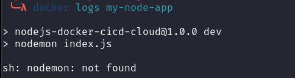
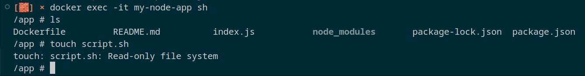
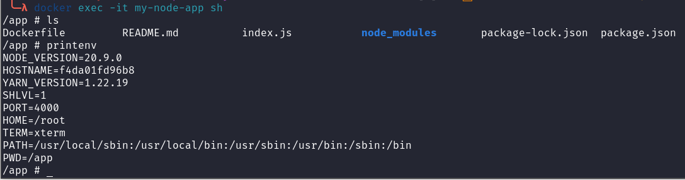
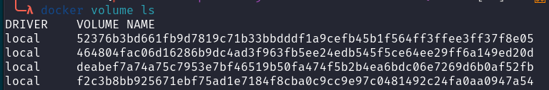
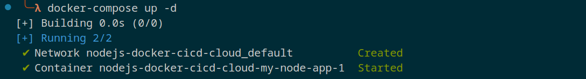
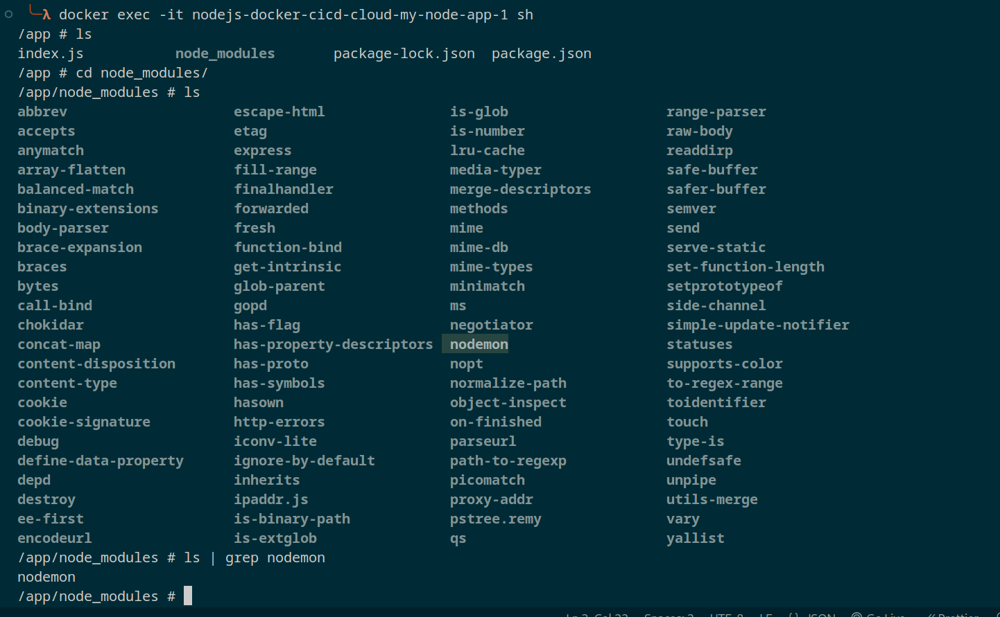

# Full Fledged DevOps Project
- Node JS Application
- Version Control System
- Containerization
- Testing
- Continuous Integration
- Continuous Delivery
- Cloud
---
## Node JS Application
Start building simple Node JS application
- Initialize Application
```
npm init
```
- Install Express JS
```
npm install express
```
- Simple Express JS app
```
const express = require("express")

const app = express()

app.get("/", (req, res) => {
    res.send("<h1> Full end to end DevOps Project</h1>")
})

const port = process.env.PORT || 3000

app.listen(port, () => console.log(`listining on ${port}`))
```
- Start server
```
node index.js
```

- Go to url 127.0.0.1:3000
Application is running

## Containerization
Make a Docker file of our express JS appliction
```
touch Dockerfile
```

```
# Need a base image of Node JS

FROM node:20-alpine

# Creating the work directory of application

WORKDIR /app

# First, copy package.json into our current directory " . "
COPY package.json .

# Install all packages
RUN npm install

# Copy rest of the files
COPY . .

Start the server
CMD [ "node", "index.js" ]
```

- ***Build the Docker Image***
```
docker build -t my-node-image .
```
- *-t* : tag flag for giving our image a name
- *.*  : it means build image from Dockerfile which is in our current directory.

- ***Check the list of images***
```
docker images
```
check your built image name and info.

- ***Start the container from image***
```
docker container run -d -p 3000:3000 my-node-image
```

- *-d* : Detach mode (terminal will be free for other commands)
- *-p* : defining port tunnel to transfer traffic from 3000 port on our pc to 3000 port of node application.

- ***Check the container***
```
docker ps
```
you'll see running container info with thier ID

- ***Stop the container***
```
docker stop <ID>
```

### Problem
During writing Dockerfile, we wrote a command *COPY . .* which copy all files including *node_modules* that is unnecessary as *RUN npm install* will install all node_modules.

### Solution
***.dockerignore***, put node_modules, DockerFile, .git and even .dockerignore as we dont need them in production.

So, delete our node_modules directory.

### Problem
Each time you make a change in code, you have to re-build the image and re-run the container to see the change, its a tedious process.

### Solution
Using volumes Bind Mount, so basically we can sync the our directory(Host Directory) with container directory so we dont have to re-run the whole process just to see the changes.

***Volumes*** are used to persist data between Host(our laptop) and container or multiple containers.

Run the container with 
```
docker run <absolute path of your current directory>:/app -d -p 4000:3000 my-node-image
```

Now you can see the changes we made in code directly in running container or can you :)

### Problem
Lets look into it if our directory sync or not, go into container

```
docker exec -it <container name || container ID> sh
```
```
ls
cat index.js
```
So, code actually did change, so whats the problem, *server didn't restart automatically when changes occurs.

### Solution
***nodemon***, it restart automatically when you made changes to code.

```
npm install nodemon --save-dev
```
lets rebuild image and re-run,

*Oops*, what happen, our container crash!!!

How did that happen? lets look into logs
```
docker logs <container name or ID>
```


But we did install nodemon, where did it went?

### Problem
When we bind mount our current code directory with working directory of container, it sync the files and as we dont have a node_modules folder and our container has one so when it syncs up our contianer will not have node_modules folder.

### Solution
Anonymous Volume
We can override our bind mount volume using this command after our bind mount,

```
-v /app/node_modules
```

re-build the container and container is running successfully, now try to make some changes.

### Problem
Go into container and try to create some files
```
docker exec -it <container name> sh
touch file.txt
```
you see, it create a file in both container and host(our laptop), as it should, it is working fine as we plan, it syncing up our directories.

But, there's a problem, we dont want our container to create files in our production(sometimes we want that, not in our case), it's a security issue.

### Solution
Make the volume read only, just add ***:ro*** after bind mount
(first delete the container *docker rm -f <contatiner name||id>)
```
docker run <absolute path of your current directory>:/app:ro -d -p 4000:3000 my-node-image
```
Check if its working or not


### Environment Variables
Like we have a port env variable, you can run contianer using env variable

- ***--env***
```
docker run -v /home/harisheoran/DevOps/DevOps-Projects/nodejs-docker-cicd-cloud:/app:ro -v app/node_modules -d --env PORT=4000 -p 5000:4000 --name my-node-app harisheoran/my-node-image
```
- Using a .env file
```
--env-file ./.env
```
Check if its working


### Problem
Lets check our created volumes,


so, when we kill the container and re-run, these volumes have created and thats allright as it is the purpose of volumes to persist data even when containers are deleted.

But, in our case we don't need them,
- Delete all non-working volumes (volume with working contianer won't be deleted)
```
docker volume prune
```
- Delete a single volume
```
docker volume rm <volume name>
```
- Delete the volume alongside deleting the container
```
docker rm <container name> -fv
```


### Solution

## Docker Compose
We are using these long commands for a while now, for now its fine, it'll become a mess when you are working with multiple containers.

Using Docker Compose we can run, stop, delete multiple containers easily.

- Install Docker Compose
- Create a compose file
```
touch Docker-Compose.yml
```

In this file, you have to define all the instruction of how you want to build the image and run the container.

```
version: '3'
services:
  my-node-app:
    build: .
    volumes:
      - ./:/app:ro
      - /app/node_modules
    #environment:
    #  - PORT=3000
    env_file:
      - ./.env
    ports:
      - 5000:4000
```
- *version* is the version of the compose file.
- *services* where you define all your containers.
- *my-node-app* is the container name.
- *build*  location of *Dockerfile* from which you want to build the image
- *volumes* as the name suggest
- *env_file* is our .env file loaction
- *ports* is for host:container ports.

***Run the Container***

```
docker-compose up -d
```
Now check the docker image name and container name, they are created according to our code directory name.

***Delete the Container***
```
docker-compose down -v
```

### Amazing thing about Docker Compose

If you re-build the container, the process is so fast from the first one,


So, docker compose didn't build the image this time, it look for an image and found it(as it already build the image when we first ran the compose file), its a feature to make the build process fast.

If you want to re-build the image,then explicity define it
(delete the running container, first)
```
docker-compose up -d --build
```

## Production v/s Development
Things are different in development and production, like we dont need some dev dependency in prod (like nodemon)
 and we don't need bind mount in prod.

How can we solve this issue?
### Solution
Create two different compose file, one for prod and one for dev.

OR


- First, create a main *docker-compose.yml* for the configs shared between both dev and prod environment.
```
version: '3'
services:
  my-node-app:
    build: .
    env_file:
      - ./.env
    ports:
      - 5000:4000
```

- Second, create a production file *docker-compose.prod.yml*
```
version: '3'
services:
  my-node-app:
    command: node index.js
    environment:
      - NODE_ENV=production
```

- Create a dev file *docker-compose.dev.yml*
```
version: '3'
services:
  my-node-app:
    volumes:
      - ./:/app:ro
      - /app/node_modules
    command: npm run dev
    environment:
      - NODE_ENV=development
```
We override some commands of *docker-compose.yml*

- Run the container in production
```
docker-compose -f docker-compose.yml -f docker-compose.prod.yml up -d
```

*Order of compose files do matter*, first put shared file and then prod file.
*-f*  is flag for file.

Simliarly you can run for dev,( remember to remove conatiner with *down* command and rebuild the image *--build*)

### Problem is not solved yet
You can see the *nodemon* the dev dependency is present in prod.

> Why is that?
In our *Dockerfile* we have
```
RUN npm install
```

It install all the dependencies, and in prod it should be
```
RUN npm install --only=production
```

So, how can docker can know if we want to run for dev or prod?

## Bash Scripting
Using bash script we can define a simple condition

In *Dockerfile*
```
ARG NODE_ENV
RUN if [ $NODE_ENV == prod ]; then \
    npm install --only=production; \
    else npm install; \
    fi 
```
- Define a argument variable
- Simple condition to check and run the appropriate install command in bash.

So, from where we pass the *NODE_ENV* value?

answer is from docker-compose.dev/prod.yml files

In *docker-compose.prod.yml*

Override the build command, 
- context: is the location of Dockerfile
- arg: is for the argument
```
version: '3'
services:
  my-node-app:
    build:
      context: .
      args:
        - NODE_ENV=prod
    command: node index.js
    environment:
      - NODE_ENV=production
```

In *docker-compose.dev.yml*
```
version: '3'
services:
  my-node-app:
    build:
      context: .
      args:
        - NODE_ENV=dev
    volumes:
      - ./:/app:ro
      - /app/node_modules
    command: npm run dev
    environment:
      - NODE_ENV=development
```

Now, re-run the dev and prod container, use *--build* to rebuild the containers.
and check the prod, and you see the *nodemon* dependency is gone.